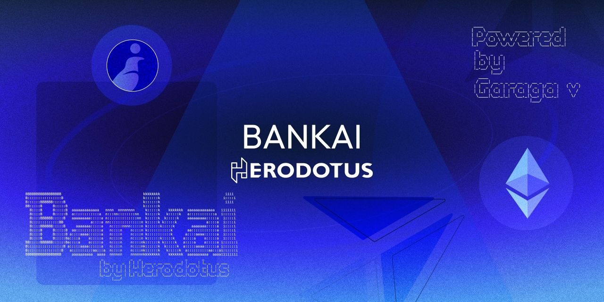
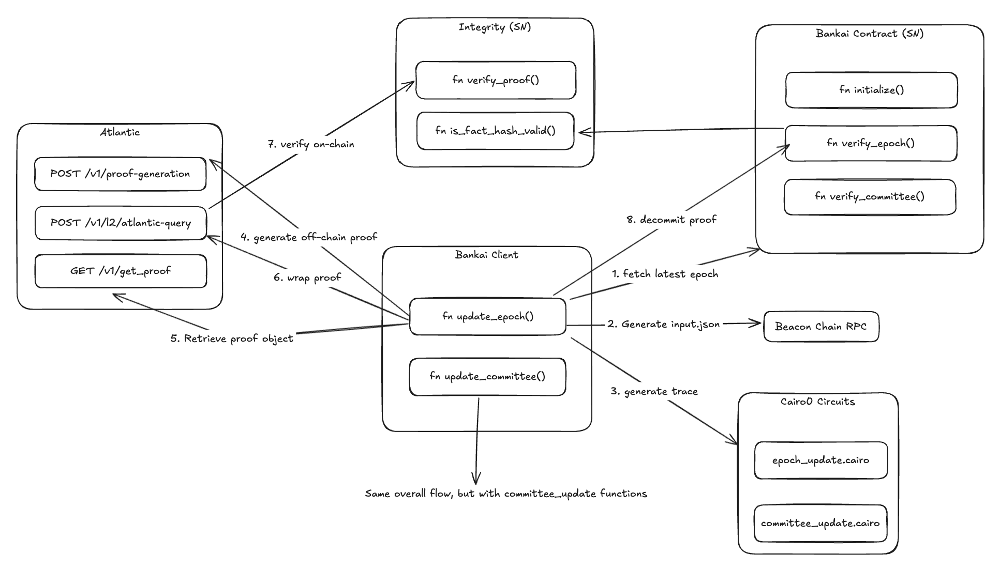

# Bankai - An Ethereum Light client, written in Cairo.



This repository contains all the code for the Bankai Ethereum Light client. It consists of 3 main components: Cairo0 circuits for verifying epoch and sync committee updates, a Rust client for generating circuit inputs, the trace and submitting them to Starknet, and a Cairo1 contract (deployed on Starknet) for decommitting and storing verified beacon chain headers.

## Table of Contents
- [Overview](#overview)
  - [Epoch Update Operations](#epoch-update-operations)
  - [Sync Committee Update Operations](#sync-committee-update-operations)
- [Getting Started](#getting-started)
  - [Prerequisites](#prerequisites)
  - [Installation](#installation)
- [Usage](#usage)
  - [CLI Commands](#cli-commands)
  - [Running Cairo Programs](#running-cairo-programs)
- [Acknowledgments](#acknowledgments)
  
## Overview

To keep the light client in sync there are 2 main operations that need to be performed: Verifying new epoch/slots and updating the sync committee, keeping up with the validator set. 

To perform these operations, we have two separate circuits available, that work together in keeping the light client in sync. The proofs of these circuits are proven and then verified using the [Integrity verifier](https://github.com/HerodotusDev/integrity), deployed on Starknet. The Bankai Cairo1 contract checks the proof was verified correctly and decommits the proof to its contract storage, making the verified data available to the Starknet network.



Overall, the steps for generating an update proof (epoch or sync committee) are pretty similiar:

1. Check the latest light client state, deriving what inputs to generate
2. Generate the inputs for the circuit. This involves querying the beacon chain for the relevant data. The circuit results are also computed
3. Using the inputs and the relevant circuit, generate the trace
4. Prove this trace using Atlantic in off-chain mode
5. Retrieve the proof from Atlantic
6. Submit the proof to atlantic, wrapping it to another layout. This step is required, as Integrity cant verify the proof using dynamic layout. The resulting (wrapped) proof uses the `recursive_with_poseidon` layout which can be verified by Integrity
7. Atlantic now submits the proof to Starknet, where it is verified by the Integrity verifier.
8. The proof is now decommited in the Bankai contract. This is achieved by constructing the expected fact hash, and checking if this fact hash is available in the Integrity fact registry. If this is the case, the verified state is written to the contract storage.


## Cairo-Zero Circuits

The two main circuits used for doing the mayority of cryptographic operations are implemented in Cairo-Zero. Using Cairo-Zero enables the utilization of hints, which greatly increaces flexibility and performance.

### Epoch Update Operations
The verification of an Beacon chain epoch requires the following steps:

1. ✓ Compute block hash and signing root
2. ✓ Convert message (signing root) to G2 point (hash_to_curve)
3. ✓ Aggregate signer public keys
4. ✓ Validate signature
5. ✓ Compute committee hash
6. ✓ Count number of signers
7. ✓ Decommit Execution Header hash and height (adds 130k steps of sha256)
8. ✓ Generate verification outputs

Implementation details can be found in `epoch_update.cairo` (~350k steps).

### Sync Committee Update Operations
To maintain continuous operation, the system validates sync committee updates through:

1. ✓ Merkle path validation
2. ✓ Public key decompression
3. ✓ Committee hash computation
4. ✓ Hash verification

Implementation details can be found in `committee_update.cairo` (~40k steps).

## Getting Started

### Prerequisites
- Beacon Chain RPC endpoint
- Rust toolchain
- Cairo development environment

### Installation
```bash
# Install dependencies and setup environment
make setup
```

Addionally, an `.env` file is required. These are the variables that need to be set:

```
STARKNET_ADDRESS=0x7b3d8f42e9a4c89e5b1f8d9f2e39c7d2b6e4a15c9d8f36e7a2b4c1d5e8f9a3b
STARKNET_PRIVATE_KEY=0x4f8a9c2b5e7d6f3a1b8c4d5e6f7a2b3c4d5e6f7a8b9c1d2e3f4a5b6c7d8e9f
STARKNET_RPC_URL=https://starknet-sepolia.infura.io/v3/your-api-key
BEACON_RPC_URL=https://eth-sepolia.g.alchemy.com/v2/your-api-key
PROOF_REGISTRY=https://example-registry.s3.amazonaws.com/proofs/
ATLANTIC_API_KEY=a1b2c3d4-e5f6-7890-abcd-ef1234567890
PROOF_WRAPPER_PROGRAM_HASH=0x193641eb151b0f41674641089952e60bc3aded26e3cf42793655c562b8c3aa0
```

(The examples above are invalid, please use your own values)

# Usage

## CLI Commands

The Bankai client provides the following command categories:

### 1. Input Generation Commands
Generate JSON inputs for circuits and debugging:

```bash
# Initialize contract with starting slot
cargo run -- contract-init --slot <SLOT> [--export <FILE>]

# Generate epoch update inputs
cargo run -- epoch-update --slot <SLOT> [--export <FILE>]

# Generate sync committee update inputs
cargo run -- committee-update --slot <SLOT> [--export <FILE>]
```

### 2. Proof Generation Commands
Generate and manage proofs for the light client state:

```bash
# Generate proof for next epoch
cargo run -- prove-next-epoch

# Generate proof for next committee
cargo run -- prove-next-committee

# Wrap and resubmit proof (required for dynamic layouts)
cargo run -- submit-wrapped-proof --batch-id <BATCH_ID>

# Check proof generation status
cargo run -- check-batch-status --batch-id <BATCH_ID>
```

### 3. Contract Management Commands
Deploy and interact with the Starknet contract:

```bash
# Deploy Bankai contract
cargo run -- deploy-contract --slot <SLOT>

# Verify and decommit proofs
cargo run -- verify-epoch --batch-id <BATCH_ID> --slot <SLOT>      # For epoch updates
cargo run -- verify-committee --batch-id <BATCH_ID> --slot <SLOT>  # For committee updates
```

> **Note**: All commands that generate proofs will automatically create input files, generate traces, and submit to Atlantic for proving. The returned batch ID can be used to track the proof status.

## Running Cairo Programs

The cairo circuits can also be run locally. For this, ensure to be in the python environment (`make venv`). Inputs for the circuits can be generated using the client.  

### Epoch Update Verification
```bash
# Copy CLI output to epoch_input.json, then:
make build-epoch
make run-epoch
```

### Committee Update Verification
```bash
# Copy CLI output to committee_input.json, then:
make build-committee
make run-committee
```

## Acknowledgments
All of this wouldnt be possible without [Garaga](https://github.com/keep-starknet-strange/garaga). Amazing stuff! Thx for your support Felt!
Bankai is proven using the [Altantic Prover](https://atlanticprover.com/) and verified using the [Integrity Verifier](https://github.com/HerodotusDev/integrity)
